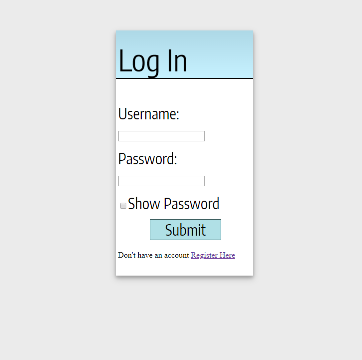

# Login-App
This web application is a system that allows users to register and log in to a website. 
The web application is build in Flask and is connected to a database to register users and to check if their username and password is correct. I also learnt Jinja to create multiple different pages from one original template.

<b>Built with</b>
- Flask
- SQLite
- Jinja
- HTML
- CSS

